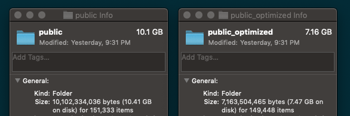

# Image Optimizer
I had to process (optimize, resize, crete thumbnails and delete) more than 150k images.

The easiest way was to create this python script.

## Usage
1. Install [PIL](https://pillow.readthedocs.io/en/stable/installation.html)
    ```
    pip install Pillow
    ```
    or
    ```
    python3 -m pip install Pillow
    ```
2. Edit file `main.py`:

    ```python
    location = "images/"  # Folder to parse
    valid_ext = [".jpg", "jpeg", ".gif", ".png"]  #  Allowed extensions
    total = processed = removed = 0  # Counters
    img_size = (1600, 1200)  # Width, height for image crop
    thumbnail = (350, 260)  # Width, height for thumbnail
    quality = 60  # Quality of saved images
    min_width = 500  # Min with for image to process
    log_nr = 5  # Every X files, Log total processed
    ```
    or ... For optimization only, edit `optimize.py`
3. Run script:

```
python main.py
```
or

``` 
python3 main.py
```

## My results

```
2019-08-15 11:41:58.286016: Parsing folder "storage/app/public_optimized/"...
2019-08-15 11:43:48.567856: ===== Processed 1000 images ...
2019-08-15 11:44:59.927010: ===== Processed 2000 images ...
2019-08-15 11:46:28.984283: ===== Processed 3000 images ...
2019-08-15 11:47:09.556696: ===== Processed 4000 images ...
2019-08-15 11:48:07.230754: ===== Processed 5000 images ...
...
2019-08-15 14:06:53.069812: ===== Processed 148000 images ...
2019-08-15 14:07:53.880363: ===== Processed 149000 images ...
2019-08-15 14:08:07.828431: Done...
Total parsed: 149219 images.
Processed: 73667 images.
Removed: 75552 images
Elapsed time: 8769.542 seconds. Aprox. 146 minutes.
Bye bye...
```

#### Before and After


